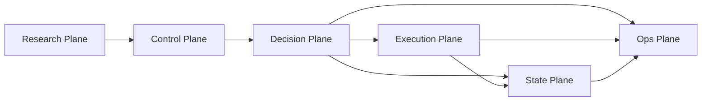
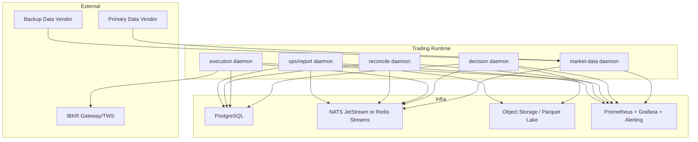

# PRODUCTION_LOW_SPEED_QUANT_SYSTEM_DESIGN

更新时间：2026-03-18  
适用范围：低速量化交易系统（分钟级到日级），以美股/ETF 为主，支持 Paper、Shadow、Production 三种运行环境。  
设计目标：在当前仓库能力基础上，重新定义一套真正可投入生产、可审计、可恢复、可扩展的量化交易系统总结构。

## 1. 系统定位

这不是高频系统，也不是研究脚本拼装出来的“能跑就行”系统。  
它应该是一套面向低速量化交易的生产系统，核心特征是：

- 低频但高可靠：允许秒级到分钟级决策延迟，但不允许重复下单、状态错位、脏数据交易。
- 策略多样但执行收口：策略可以多源、多模型、多插件，但发单路径只能有一个。
- AI 可辅助，但不能替代确定性风控：AI 只作为上下文增强与候选评分，不能成为资金安全的单点依赖。
- 可恢复优先于可用性：重启、断网、Gateway 波动时，先对账，后交易。
- 可审计优先于“聪明”：每一笔信号、风控决策、订单意图、券商回报必须可以串起来复盘。

## 2. 顶级设计原则

## 2.1 生产第一原则

- `Zero Duplicate Orders`：同一交易意图绝不允许重复发单。
- `Fail Closed`：数据、风控、执行状态不明时，阻断新开仓，只允许保护性减仓。
- `Reconcile Before Trade`：任何重启、断线恢复、部署切换后，必须先对账再恢复交易。
- `Single Writer to Broker`：全系统只能有一个执行写入口可以触达券商。
- `Deterministic Core`：核心风控、仓位、订单意图生成必须是确定性的。

## 2.2 低速量化的正确架构观

对于低速量化，最好的系统不是几十个微服务，而是：

- 清晰的领域分层
- 少量长期运行进程
- 强约束的事件契约
- 单一真相数据库
- 可重放的事件历史

换句话说，生产级低速量化系统的上限不在“分布式有多花”，而在“状态一致性与审计闭环有多严”。

## 3. 目标系统总图

## 3.1 五大运行平面



五大平面定义如下：

1. `Research Plane`
   - 策略研发、回测、特征工程、参数管理、模拟验证。
2. `Control Plane`
   - 配置发布、策略启停、交易日调度、环境切换、权限控制。
3. `Decision Plane`
   - 数据接入、特征生成、信号计算、组合构建、风险审批。
4. `Execution Plane`
   - 订单管理、执行编排、对账恢复、券商适配、回报处理。
5. `Ops Plane`
   - 日志、指标、追踪、告警、日报、运行手册、值班支持。

## 3.2 推荐运行拓扑



## 4. 核心领域分层

## 4.1 Market Data Layer

职责：
- 行情、新闻、交易日历、公司行为、参考数据统一接入。
- 做数据质量校验、主备切换、时间戳标准化、脏数据拦截。
- 生成标准化 `MarketSnapshot`、`NewsBatch`、`DataHealth`。

输入：
- 主数据源（建议独立于券商）
- 备数据源
- 券商实时 L1/L2
- 交易日历与 corporate actions

输出：
- `MarketSnapshot`
- `NewsBatch`
- `ReferenceData`
- `DataHealthEvent`

生产要求：
- 生产环境禁止使用静态默认快照作为交易依据。
- 每个 snapshot 必须有 `snapshot_id`、`vendor`、`snapshot_ts`、`quality_status`。
- 数据质量异常时，必须向风控层发出 `data degraded` 事件。

当前仓库映射：
- 保留并升级：[market_data.py](/Users/cloudsripple/Documents/trae_projects/AAQ/src/phase0/market_data.py:16)
- 保留探针能力：[ibkr_paper_check.py](/Users/cloudsripple/Documents/trae_projects/AAQ/src/phase0/ibkr_paper_check.py:212)

## 4.2 Feature & Context Layer

职责：
- 从市场数据生成特征、市场结构指标、行业轮动信号、新闻语义特征。
- 产出可回放的 `FeatureSnapshot`。
- 向策略层提供稳定输入，避免策略直接读原始 vendor 格式。

输入：
- `MarketSnapshot`
- `NewsBatch`
- 历史 bar / reference data

输出：
- `FeatureSnapshot`
- `ContextAssessment`

关键要求：
- 特征计算版本化。
- 每次计算要带 `feature_schema_version` 与 `feature_digest`。
- 同一时刻的策略输入必须可重建。

当前仓库映射：
- 保留策略插件与因子加载能力：[strategies/loader.py](/Users/cloudsripple/Documents/trae_projects/AAQ/src/phase0/strategies/loader.py:27)
- Low/Ultra 的一部分逻辑应下沉到此层，而不是散落在总控模块。

## 4.3 Signal Engine Layer

职责：
- 多策略并行计算候选信号。
- 明确区分“交易想法”与“可执行订单”。
- 做 alpha 层面的评分、过滤、排序，但不直接做发单决定。

输入：
- `FeatureSnapshot`
- `ContextAssessment`
- 策略配置与组合约束

输出：
- `SignalEvent`
- `SignalCandidateSet`

必须原则：
- 信号层不直接调用券商、不直接落订单状态。
- 任何 AI 输出只能作为 signal context 或 score boost，不能直接构造发单 payload。

当前仓库映射：
- `strategies/*`
- `ai/low.py` 的部分慢速上下文分析
- `ai/ultra.py` 的事件检测能力

## 4.4 Portfolio Construction Layer

这是当前仓库明显缺失但生产系统必须拥有的一层。

职责：
- 从多策略候选信号构造组合级目标。
- 做账户级预算分配、相关性约束、行业/主题/风格敞口控制。
- 形成 `PortfolioIntent`，而不是单标的孤立下单。

输入：
- `SignalCandidateSet`
- 当前持仓
- 账户净值
- 策略预算
- 风格与行业暴露

输出：
- `PortfolioIntent`
- `TargetWeights`
- `RebalancePlan`

为什么必须有：
- 顶级量化系统不是“来一个信号，下一个单”。
- 它必须先问：这个信号在整个组合里该占多少、是否和已有风险重复、是否与今日其他信号冲突。

建议实现：
- 先支持单账户、单组合。
- 后续扩展到多账户、多组合、多策略资金池。

### 4.4.1 Mandatory Account Capability & Product Eligibility Guard

这是生产系统里必须单独建模的一层，不能只靠“券商拒单了再说”。

职责：
- 描述账户到底被允许交易什么。
- 在风控前拦截不被账户权限允许的产品、方向、杠杆和订单结构。
- 将券商账户真实权限与内部策略权限做交集，形成最终可交易边界。

输入：
- Broker capability snapshot
- Internal trading policy
- Account legal type
- Strategy requested instrument / side / order shape

输出：
- `AccountCapabilityProfile`
- `ProductEligibilityDecision`
- `CapabilityViolationEvent`

必须校验的能力维度：
- 是否允许股票
- 是否允许 ETF
- 是否允许期权
- 是否允许期货
- 是否允许做空
- 是否允许融资融券
- 是否允许多腿组合单
- 是否允许裸卖期权
- 是否允许杠杆大于 `1.0`
- 是否允许盘前盘后交易
- 是否允许使用未结算资金

对你当前账户，推荐固化为以下生产能力画像：

```text
account_profile_id = cash_long_only_us_equities_v1
account_type = cash
allowed_asset_classes = [STK, ETF]
allow_options = false
allow_futures = false
allow_short_selling = false
allow_margin = false
allow_multi_leg = false
allow_naked_option = false
max_gross_leverage = 1.0
allow_buy_to_open = true
allow_sell_to_close = true
allow_sell_short = false
require_settled_cash_for_opening = true
```

这意味着系统必须强制执行以下规则：
- 只能开多仓，不能开空仓。
- 卖出动作只允许 `sell to close` 已持有的多头仓位。
- 不允许任何 `OPT/FOP/FUT/CFD` 等衍生品进入下单链路。
- 不允许因为资金不足、未结算资金或融资需求而生成新订单。
- 不允许出现负持仓数量。
- 所有保护性卖单必须绑定到真实已有多头仓位或待成交多头父单。

对于低速现金账户，这一层比“策略好不好”更重要，因为它定义了系统不会去做哪些事情。

## 4.5 Risk Engine Layer

职责：
- 统一承接所有交易前、交易中、交易后的风险校验。
- 把 `SignalEvent / PortfolioIntent` 转化成 `RiskDecision` 与 `OrderIntent`。
- 这是所有新开仓和加仓的必经层。

输入：
- `PortfolioIntent`
- `SignalEvent`
- `AccountCapabilityProfile`
- 持仓、未成交订单、回撤、净值、session 状态、数据质量状态

输出：
- `RiskDecision`
- `OrderIntent`
- `RiskAuditEvent`

必须覆盖的风险域：

1. 数据风险
   - snapshot 过期
   - vendor 冲突
   - abnormal jump
   - data gap

2. 策略风险
   - 信号陈旧
   - 同方向过密
   - alpha crowding

3. 组合风险
   - 总敞口
   - 单标的集中度
   - 行业集中度
   - 风格偏移
   - Beta/杠杆预算

4. 交易风险
   - 价格结构错误
   - 风险预算超限
   - 冷却期
   - 会话窗口
   - 流动性不足
   - 账户权限不允许该品类或方向
   - 现金账户可用资金/已结算资金不足
   - 卖出数量超过当前持仓

5. 运营风险
   - Gateway 不稳定
   - DB 锁冲突
   - 时钟异常
   - 对账未完成

当前仓库映射：
- 保留硬规则核心：[lanes/high.py](/Users/cloudsripple/Documents/trae_projects/AAQ/src/phase0/lanes/high.py:47)
- 保留并强化组合/状态风险：[risk_engine.py](/Users/cloudsripple/Documents/trae_projects/AAQ/src/phase0/risk_engine.py:21)
- 保留安全模式：[safety.py](/Users/cloudsripple/Documents/trae_projects/AAQ/src/phase0/safety.py:23)

## 4.6 OMS Layer

OMS 是生产级量化系统的心脏之一。

职责：
- 统一管理 `OrderIntent`
- 生成稳定 `intent_id`
- 维护订单状态机
- 管理订单生命周期与重试策略
- 连接 Risk 与 EMS

输入：
- `OrderIntent`

输出：
- `OrderRecord`
- `ExecutionRequest`
- `OrderStateTransition`

必须规则：
- 同一 `intent_id` 只能首次提交一次。
- 所有状态转移必须持久化。
- OMS 才有资格把“风险批准的意图”递交给执行层。

当前仓库映射：
- 可复用状态机与生命周期逻辑：[execution_lifecycle.py](/Users/cloudsripple/Documents/trae_projects/AAQ/src/phase0/execution_lifecycle.py:34)
- 可复用持久化能力：[state_store.py](/Users/cloudsripple/Documents/trae_projects/AAQ/src/phase0/state_store.py:35)

## 4.7 EMS / Broker Adapter Layer

职责：
- 负责把 `ExecutionRequest` 转成券商可接受的 payload。
- 负责提交、重试、超时处理、回报采集、保护腿完整性检查。
- 负责 broker status 与 local status 的双状态映射。

输入：
- `ExecutionRequest`

输出：
- `BrokerOrderAck`
- `ExecutionReport`
- `FillEvent`
- `BrokerStateSnapshot`

关键原则：
- 全系统只有这一个层可以真正调用券商 API。
- 执行层不再自行重算仓位、止损、止盈，它只消费已经批准的订单意图。

当前仓库映射：
- 适配器保留：[ibkr_order_adapter.py](/Users/cloudsripple/Documents/trae_projects/AAQ/src/phase0/ibkr_order_adapter.py:6)
- 执行客户端保留并重构：[ibkr_execution.py](/Users/cloudsripple/Documents/trae_projects/AAQ/src/phase0/ibkr_execution.py:80)

## 4.8 Reconcile & Recovery Layer

职责：
- 启动时对账
- 断线恢复对账
- 日内状态校准
- 确保本地账本与券商状态一致

输入：
- broker open orders
- broker positions
- broker executions
- local OMS/EMS state

输出：
- `ReconcileResult`
- `StateCorrectionEvent`
- system status transition

必须要求：
- 未完成对账不得进入 `RUNNING`
- 对账失败时进入 `DEGRADED` 或 `HALTED`
- 对账修正必须留下审计痕迹

当前仓库映射：
- 这部分基础已经存在：[ibkr_execution.py](/Users/cloudsripple/Documents/trae_projects/AAQ/src/phase0/ibkr_execution.py:730)
- 但还需要从旧 cycle 编排中独立出来，成为常驻服务

## 4.9 Ops & Observability Layer

职责：
- 结构化日志
- 指标
- 追踪
- 告警
- 日报
- 值班工具

输出必须覆盖：
- 数据健康
- 策略命中
- 风险拒绝率
- 下单成功率
- 订单拒单率
- 平均与 P95 延迟
- 滑点
- 回撤
- 系统状态切换次数

当前仓库映射：
- 保留：[observability.py](/Users/cloudsripple/Documents/trae_projects/AAQ/src/phase0/observability.py:1)
- 保留日报：[daily_health_report.py](/Users/cloudsripple/Documents/trae_projects/AAQ/src/phase0/daily_health_report.py:17)
- 保留运行手册：[RUNBOOK.md](/Users/cloudsripple/Documents/trae_projects/AAQ/RUNBOOK.md:1)

## 5. 当前 Ultra / Low / High 的正确定位

当前仓库里的 Ultra / Low / High 命名本身有价值，但要重新定义它们在生产系统里的职责。

## 5.1 Ultra = Event Sentinel

定位：
- 检测突发事件、盘口异常、新闻冲击、急速风险变化。
- 它是“哨兵层”，不是完整的交易决策层。

正确职责：
- 快速发现异常
- 生成 event tags
- 触发风控升级、仓位收缩、信号唤醒、保护性减仓

不该做的事：
- 直接构建最终订单
- 在缺少真实事件输入时伪造 tick

## 5.2 Low = Regime & Allocation Context

定位：
- 慢速背景层，处理行业轮动、市场 regime、组合配置偏好、宏观过滤。

正确职责：
- 给策略层和组合层提供背景偏置
- 做 sector/style/market regime 评估
- 影响预算与排序，而不是直接发单

不该做的事：
- 通过反向订阅 `high.decision` 再去补算自己

## 5.3 High = Deterministic Risk Policy Gate

定位：
- 高速硬规则层，是策略与执行之间的确定性闸门。

正确职责：
- 校验价格结构
- 计算仓位
- 控制单笔风险
- 生成 bracket / protection 结构
- 给 Risk Engine 提供确定性的 pre-trade decision kernel

不该做的事：
- 混合承担组合构建、背景分析、执行回报处理

## 6. 事件契约体系

生产系统必须用稳定契约，而不是 dict 到处乱传。

## 6.1 核心事件

### `MarketSnapshot`
- `snapshot_id`
- `vendor`
- `snapshot_ts`
- `symbols`
- `quality_status`
- `latency_ms`

### `FeatureSnapshot`
- `feature_snapshot_id`
- `snapshot_id`
- `feature_schema_version`
- `feature_digest`
- `published_at`

### `SignalEvent`
- `signal_id`
- `trace_id`
- `strategy_id`
- `symbol`
- `side`
- `signal_strength`
- `confidence`
- `feature_snapshot_id`
- `generated_at`

### `ContextAssessment`
- `context_id`
- `trace_id`
- `symbol_scope`
- `regime_label`
- `sector_bias`
- `event_tags`
- `source_models`
- `published_at`

### `AccountCapabilityProfile`
- `account_profile_id`
- `broker_account_type`
- `allowed_asset_classes`
- `allow_options`
- `allow_short_selling`
- `allow_margin`
- `allow_multi_leg`
- `max_gross_leverage`
- `require_settled_cash_for_opening`
- `updated_at`

### `PortfolioIntent`
- `portfolio_intent_id`
- `trace_id`
- `signal_ids`
- `target_weight`
- `max_capital`
- `rebalance_reason`

### `RiskDecision`
- `decision_id`
- `trace_id`
- `portfolio_intent_id`
- `approved`
- `reason_codes`
- `risk_snapshot`
- `computed_limits`

### `OrderIntent`
- `intent_id`
- `trace_id`
- `decision_id`
- `symbol`
- `side`
- `quantity`
- `entry_type`
- `limit_price`
- `stop_price`
- `take_profit_price`
- `time_in_force`
- `protection_spec`

### `ExecutionReport`
- `report_id`
- `trace_id`
- `intent_id`
- `broker_order_ids`
- `broker_status`
- `local_status`
- `filled_qty`
- `avg_fill_price`
- `latency_ms`
- `error_code`
- `occurred_at`

## 6.2 生产要求

- 所有事件必须可 JSON 序列化并版本化。
- 所有事件必须能通过 `trace_id` 串起来。
- 任何写券商路径都必须先拥有 `intent_id`。

## 7. 数据与存储架构

## 7.1 Operational Truth

推荐使用：
- `PostgreSQL` 作为交易运行时唯一真相库

原因：
- SQLite 适合作为当前原型或单机轻量状态存储
- 生产环境需要更强的并发、备份、监控、恢复能力

核心表：
- `system_state`
- `config_revisions`
- `market_snapshot_registry`
- `feature_snapshots`
- `signal_events`
- `context_assessments`
- `portfolio_intents`
- `risk_decisions`
- `order_intents`
- `broker_orders`
- `fills`
- `positions`
- `execution_reports`
- `alerts`

## 7.2 Historical Lake

推荐使用：
- `Parquet + object storage`
- 分区按 `trade_date / strategy / symbol`

用途：
- 回测基线
- 训练样本
- 执行质量分析
- 因子衰减分析

## 7.3 Ephemeral Cache

推荐使用：
- `Redis`

用途：
- 运行时缓存
- 短期去重
- worker 心跳
- dashboard 快速读取

注意：
- Redis 不是订单真相源
- 不允许只存在 Redis 而不落主库

## 8. 执行架构的正确形态

## 8.1 一个系统只能有一个 Broker Writer

这条是顶级生产系统的底线。

意味着：
- 不能 `main.py` 发一条
- `execution_subscriber.py` 再发一条
- 某个兼容脚本也能发一条

正确做法：
- 所有新单、改单、撤单、保护腿提交，都统一走 `execution daemon`

## 8.2 低速量化最适合的执行模型

对于低速系统，推荐三类执行模式：

1. `Marketable Limit`
   - 适合明确要成交但又要防止极端滑点
2. `Passive Limit`
   - 适合流动性较好、对成交不极端敏感的入场
3. `Bracket/OCO`
   - 适合仓位一旦建立就必须带保护单

不推荐：
- 在信号层临时拼装复杂自适应算法单
- 多个模块各自决定订单腿结构
- 把“账户能不能做这笔交易”留到 broker reject 才发现

## 8.3 执行必须内建的机制

- `intent_id` 幂等
- broker order id 映射
- submit retry
- session guard
- protection leg completeness check
- reject recovery
- order state machine
- startup reconcile

当前仓库里这几块已经有不少基础，只是还没彻底收口。

## 9. 风险体系的顶级版本

## 9.1 风险要分四层

### Layer 1: Pre-Trade Risk
- 数据是否可信
- 信号是否陈旧
- 单笔风险是否超限
- 总敞口是否超限
- 单标的/行业/风格是否集中
- 会话与市场状态是否允许开仓

### Layer 2: In-Flight Execution Risk
- 订单是否超时未确认
- 保护腿是否丢失
- 滑点是否异常
- Gateway 是否异常抖动

### Layer 3: Post-Trade Portfolio Risk
- 当日损失
- 最大回撤
- 净风险暴露
- Beta / sector drift
- overnight 风险预算

### Layer 4: Operational Risk
- 数据供应商断流
- DB 不可写
- 时钟漂移
- 对账失败
- 进程状态未知

## 9.2 Kill Switch 设计

至少应有三类：

1. `Soft Kill`
   - 停止新开仓
   - 保留减仓

2. `Hard Kill`
   - 停止所有新增执行
   - 只允许风控平仓/撤单

3. `Operational Halt`
   - 系统进入 `HALTED`
   - 只能人工确认后恢复

## 10. AI 在生产系统中的正确位置

这是当前仓库尤其需要重新定义的一块。

## 10.1 AI 可以做什么

- 新闻语义分类
- regime 注释
- watchlist 排序辅助
- 研究摘要与日报增强
- 特征提取与标签辅助

## 10.2 AI 不应该做什么

- 成为唯一的新仓放行条件
- 在执行关键路径里阻塞 broker write
- 在风控核心路径上取代确定性规则
- 在网络异常时让系统进入不明状态

## 10.3 顶级做法

把 AI 放在 `Context Intelligence Service`：

- 输出版本化 `ContextAssessment`
- 允许 fallback
- 输出可审计
- 没有 AI 时系统仍能运行核心 deterministic 路径

这意味着当前 `AI_ENABLED` 不应只是一个临时开关，而应是：
- `AI_MODE=disabled/advisory/research_only`

## 10.4 AI 与账户权限的边界

AI 可以建议：
- 某条新闻是否值得关注
- 某个标的在当前市场 regime 中是否更有吸引力
- 某个信号应降低还是提高优先级

AI 不可以越过账户权限边界：
- AI 不能建议“去卖空”然后让系统尝试下单
- AI 不能建议“用期权替代股票”然后让系统动态切换到期权
- AI 不能在现金账户里暗中扩大杠杆

账户权限闸门必须先于 AI 建议落到最终订单层生效。

## 11. 生产部署形态

## 11.1 推荐部署

### Primary Trading Node
- 运行 decision / execution / reconcile / ops daemons
- 只在一个 active node 上拥有 broker write 权限

### Broker Gateway Node
- 独立运行 IBKR Gateway / TWS
- 尽量不要和研究环境混用

### Database Node
- PostgreSQL 主库
- 备份与只读副本

### Warm Standby Node
- 平时 shadow 运行
- 故障时人工切主

## 11.2 环境分层

- `dev`
- `research`
- `paper`
- `shadow`
- `prod`

要求：
- `paper` 与 `prod` 配置完全隔离
- `prod` 的 secrets、账户、broker session 不与 research 混用

## 12. 系统级 SLO / NFR

## 12.1 可靠性指标

- 新单重复提交容忍度：`0`
- 启动后进入 `RUNNING` 的前提：`100% reconcile success`
- 状态持久化 RPO：`0`
- 主动故障恢复 RTO：`< 10 min`
- P95 券商 ACK 延迟：按 broker 条件设阈值并告警

## 12.2 数据指标

- 实时 snapshot 最大允许陈旧：按策略频率配置
- 新闻最大可用时延：按事件策略配置
- 数据源切换必须留下审计记录

## 12.3 风险指标

- 每日损失限制
- 最大回撤限制
- 单标的集中度
- 行业集中度
- 执行滑点阈值
- 权限违规尝试次数
- 因账户类型导致的拒单率

## 13. 研究到生产的生命周期

生产级量化系统必须把“研究”和“交易”隔离开，但又能闭环。

## 13.1 生命周期

```text
idea
 -> research notebook
 -> offline backtest
 -> walk-forward / stress test
 -> paper trading
 -> shadow production
 -> capital ramp
 -> full production
```

## 13.2 每个策略必须有

- 策略版本
- 特征版本
- 风险预算
- 适用品种与时段
- 回测基线
- shadow 结果
- stop conditions

## 14. 当前仓库在目标系统中的归宿

## 14.1 可以成为生产底座的部分

- [market_data.py](/Users/cloudsripple/Documents/trae_projects/AAQ/src/phase0/market_data.py:16)
- [strategies/loader.py](/Users/cloudsripple/Documents/trae_projects/AAQ/src/phase0/strategies/loader.py:27)
- [lanes/high.py](/Users/cloudsripple/Documents/trae_projects/AAQ/src/phase0/lanes/high.py:47)
- [risk_engine.py](/Users/cloudsripple/Documents/trae_projects/AAQ/src/phase0/risk_engine.py:21)
- [ibkr_order_adapter.py](/Users/cloudsripple/Documents/trae_projects/AAQ/src/phase0/ibkr_order_adapter.py:6)
- [ibkr_execution.py](/Users/cloudsripple/Documents/trae_projects/AAQ/src/phase0/ibkr_execution.py:80)
- [execution_lifecycle.py](/Users/cloudsripple/Documents/trae_projects/AAQ/src/phase0/execution_lifecycle.py:34)
- [state_store.py](/Users/cloudsripple/Documents/trae_projects/AAQ/src/phase0/state_store.py:35)
- [observability.py](/Users/cloudsripple/Documents/trae_projects/AAQ/src/phase0/observability.py:1)

## 14.2 需要重新定义职责的部分

- [ai/ultra.py](/Users/cloudsripple/Documents/trae_projects/AAQ/src/phase0/ai/ultra.py:335)
- [ai/low.py](/Users/cloudsripple/Documents/trae_projects/AAQ/src/phase0/ai/low.py:36)
- [ai/high.py](/Users/cloudsripple/Documents/trae_projects/AAQ/src/phase0/ai/high.py:44)
- [main.py](/Users/cloudsripple/Documents/trae_projects/AAQ/src/phase0/main.py:21)
- [lanes/__init__.py](/Users/cloudsripple/Documents/trae_projects/AAQ/src/phase0/lanes/__init__.py:46)

## 14.3 应视为过渡遗留层的部分

- [app.py](/Users/cloudsripple/Documents/trae_projects/AAQ/src/phase0/app.py:15)
- [lanes/ultra.py](/Users/cloudsripple/Documents/trae_projects/AAQ/src/phase0/lanes/ultra.py:6)
- [lanes/low_subscriber.py](/Users/cloudsripple/Documents/trae_projects/AAQ/src/phase0/lanes/low_subscriber.py:13)
- 当前以 `run_lane_cycle` 为核心的总控编排方式

## 14.4 为账户权限控制建议新增的模块

- `src/phase0/account_capabilities.py`
  - 负责定义 `AccountCapabilityProfile`
  - 负责把 broker 权限、内部配置、账户类型融合为统一画像

- `src/phase0/product_eligibility.py`
  - 负责校验某个 `SignalEvent / PortfolioIntent / OrderIntent` 是否符合账户权限
  - 输出标准化 `ProductEligibilityDecision`

- `src/phase0/cash_controls.py`
  - 负责现金账户特有规则
  - 包括 settled cash、unsettled cash、free-riding / good-faith 风险控制

## 14.5 当前仓库中应接入这套能力的关键点

- [config.py](/Users/cloudsripple/Documents/trae_projects/AAQ/src/phase0/config.py:23)
  - 新增账户能力配置，而不是只配策略参数

- [risk_engine.py](/Users/cloudsripple/Documents/trae_projects/AAQ/src/phase0/risk_engine.py:21)
  - 在 pre-trade risk 中增加 `ACCOUNT_CAPABILITY_BLOCKED`、`SETTLED_CASH_INSUFFICIENT`、`SHORT_SELL_FORBIDDEN` 等规则

- [ibkr_order_adapter.py](/Users/cloudsripple/Documents/trae_projects/AAQ/src/phase0/ibkr_order_adapter.py:6)
  - 在适配层再次校验只输出允许的合约类型和方向

- [ibkr_execution.py](/Users/cloudsripple/Documents/trae_projects/AAQ/src/phase0/ibkr_execution.py:104)
  - 执行前做最终 defensive check，防止 broker 写入口接收到越权意图

- [state_store.py](/Users/cloudsripple/Documents/trae_projects/AAQ/src/phase0/state_store.py:35)
  - 保存 `account_capability_snapshot` 和权限违规审计

## 15. 最终结论

这套系统的顶级形态，不应该再是“一个总控函数串起所有逻辑”，也不应该是“多个 daemon 先跑起来再慢慢补闭环”。

它应该是：

- 一个以 `事件契约` 为骨架的系统
- 一个以 `Risk -> OMS -> EMS` 为铁律的系统
- 一个以 `Reconcile Before Trade` 为启动原则的系统
- 一个以 `PostgreSQL + Durable Event Bus + Structured Observability` 为基础设施的系统
- 一个把 AI 放在辅助上下文，而不是资金安全主链路上的系统
- 一个把“账户真实能做什么”前置为硬约束，而不是把权限错误留给券商拒单的系统

如果把这套设计落地，你得到的将不再是一个“能跑的量化原型”，而是一套真正能进生产、能扩资金、能复盘、能值班、能应对故障的低速量化交易系统。
