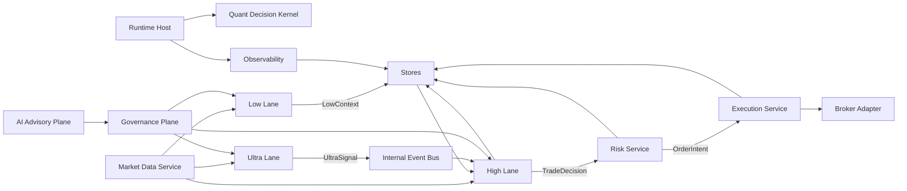

# AAQ Master Remediation And Architecture Refactor Plan

更新时间：2026-03-19

## 1. 文档目的

这份文档是当前窗口的总基线。

它的目标不是继续讨论“理想架构”，而是把以下内容收敛成一个统一、可执行、可审计的工程方案：

- 当前仓库的真实结构问题
- 目标架构应该长成什么样
- 当前代码与目标架构冲突在哪里
- 从现有代码迁移到目标架构的依赖顺序
- 未来 4 周内应该如何组织修复和重构
- AI advisory、运行治理、状态恢复、降级机制应该如何落地
- 文件级迁移动作和优先级

本文件作为当前阶段的唯一“总修复计划”。

以下两份文档仍然保留，但角色变为本文件的支撑材料：

- [TOP_LEVEL_DESIGN_AI_ADVISORY.md](/Users/cloudsripple/Documents/trae_projects/AAQ/docs/architecture/TOP_LEVEL_DESIGN_AI_ADVISORY.md)
- [REFACTOR_BLUEPRINT_AI_ADVISORY.md](/Users/cloudsripple/Documents/trae_projects/AAQ/docs/architecture/REFACTOR_BLUEPRINT_AI_ADVISORY.md)

## 2. 执行摘要

当前仓库不是一个“边界清晰的模块化单体”，而是一个“概念完整但主路径重复、边界混合、运行模式并存的单体原型”。

它的问题不在于“代码量多”，而在于以下 6 类结构性问题同时存在：

1. 运行时有两套主路径
2. High 不是唯一决策收口点
3. AI 输出直接进入 live decision path
4. 外部 IO 越层
5. 状态存储没有 ownership
6. 文档、代码、运行规则没有完全对齐

因此，本次工作窗口的正确目标不是直接开始大量改代码，而是：

1. 固化目标架构和工程边界
2. 固化修复机制和修复顺序
3. 固化运行规则和恢复策略
4. 在此基础上，再进入代码改造

本文件的核心结论是：

- AAQ 应定位为 `single-host modular monolith`
- 内核是 `Quant Core`
- AI 是 `bounded advisory plane`
- `High` 是唯一 `TradeDecision` 收口点
- 风控和执行必须可以在 `AI=OFF` 时独立工作
- 所有外部 IO 必须只能经由 adapters
- 所有 AI 自动调整必须只能经由 governance plane 生效

## 3. 当前仓库的真实诊断

### 3.1 当前系统实际是什么

当前系统更像：

- 一个单宿主、单仓库、强验证能力的原型交易系统
- 同时混合了同步 lane cycle 和事件驱动 daemon runtime
- 同时混合了策略、AI、纪律、执行、审计、观测、探针、报告脚本

它已经具备一些正确方向：

- typed signal contracts
- replay / validation / health report
- risk engine / execution lifecycle / idempotency
- observability / alerting / audit
- AI parameter adjustment 雏形

但这些能力没有被收敛到一条主路径上。

### 3.2 当前最核心的架构症状

#### 症状 1：两套 runtime 并存

当前至少存在两套运行语义：

- health-check / lane cycle 路径
- event-driven daemon 路径

关键文件：

- [src/phase0/main.py](/Users/cloudsripple/Documents/trae_projects/AAQ/src/phase0/main.py)
- [src/phase0/app.py](/Users/cloudsripple/Documents/trae_projects/AAQ/src/phase0/app.py)
- [src/phase0/lanes/__init__.py](/Users/cloudsripple/Documents/trae_projects/AAQ/src/phase0/lanes/__init__.py)

问题：

- 同一套业务语义被两种装配方式表达
- 后续任何变更都需要双轨维护
- 文档很难定义“唯一主路径”

#### 症状 2：`lanes/__init__.py` 已经是总装厂

关键文件：

- [src/phase0/lanes/__init__.py](/Users/cloudsripple/Documents/trae_projects/AAQ/src/phase0/lanes/__init__.py)

它目前同时承担：

- 市场快照获取
- strategy signal 聚合
- Ultra signal 生产
- Low AI committee
- High AI adjustment
- High decision
- discipline gate
- parameter audit
- broker payload mapping
- bus publish / consume

这说明系统实际上没有单独的 coordinator。

#### 症状 3：Execution 阶段重复做了一次 High

关键文件：

- [src/phase0/execution_subscriber.py](/Users/cloudsripple/Documents/trae_projects/AAQ/src/phase0/execution_subscriber.py)

问题：

- 它先消费 `high.decision`
- 再构造 `ExecutionIntentEvent`
- 再把 intent 反向拼成 `high_event`
- 再调用 `evaluate_event()`

这会导致：

- High 不是唯一决策收口点
- Execution 层具有第二套 decision closure
- 审计链变得不确定

#### 症状 4：AI 不是 advisory，而是主链的一部分

关键文件：

- [src/phase0/ai/high.py](/Users/cloudsripple/Documents/trae_projects/AAQ/src/phase0/ai/high.py)
- [src/phase0/ai/low.py](/Users/cloudsripple/Documents/trae_projects/AAQ/src/phase0/ai/low.py)
- [src/phase0/ai/ultra.py](/Users/cloudsripple/Documents/trae_projects/AAQ/src/phase0/ai/ultra.py)
- [src/phase0/lanes/__init__.py](/Users/cloudsripple/Documents/trae_projects/AAQ/src/phase0/lanes/__init__.py)

问题：

- AI 结果直接生成 `HighDecisionEvent`
- AI 结果直接改 `stop_loss_pct`
- AI 结果直接改 `risk_multiplier`
- AI 结果没有先走 governance / proposal / approval / audit / TTL replay

#### 症状 5：`state_store.py` 是整个状态宇宙

关键文件：

- [src/phase0/state_store.py](/Users/cloudsripple/Documents/trae_projects/AAQ/src/phase0/state_store.py)

问题：

- runtime state
- system status
- low analysis
- idempotency
- execution report
- open orders
- positions
- risk audit
- risk outcome
- lifecycle
- execution quality
- alerts

全部长在一个模块里。

这会导致：

- ownership 模糊
- 恢复顺序不明确
- 测试隔离困难
- 未来 schema 演进风险很高

#### 症状 6：IO boundary 泄漏

关键文件：

- [src/phase0/app.py](/Users/cloudsripple/Documents/trae_projects/AAQ/src/phase0/app.py)
- [src/phase0/ai/high.py](/Users/cloudsripple/Documents/trae_projects/AAQ/src/phase0/ai/high.py)
- [src/phase0/ai/low.py](/Users/cloudsripple/Documents/trae_projects/AAQ/src/phase0/ai/low.py)
- [src/phase0/ibkr_execution.py](/Users/cloudsripple/Documents/trae_projects/AAQ/src/phase0/ibkr_execution.py)
- [src/phase0/ibkr_paper_check.py](/Users/cloudsripple/Documents/trae_projects/AAQ/src/phase0/ibkr_paper_check.py)

问题：

- runtime 层直接做 socket 探针
- advisory/domain 层直接做 LLM 调用
- execution 混合模块直接做 IBKR SDK 调用

说明仓库还没有真正形成 `service -> adapter` 的边界。

## 4. 本次修复窗口的明确目标

这个窗口不以“改代码量”为目标，而以“形成确定的修复机制和修复规划”为目标。

本窗口必须产出并固化以下 8 个东西：

1. 一份目标架构的权威定义
2. 一份当前冲突的权威清单
3. 一份完整的文件级迁移基线
4. 一份 4 周路线图
5. 一套 AI advisory 治理机制
6. 一套 runtime SLA 和降级规则
7. 一套状态恢复和重启顺序
8. 一条后续代码改造必须遵守的依赖顺序

## 5. 目标架构

### 5.1 总体定位

目标架构不是微服务。

目标架构是：

`单宿主、模块化单体、单一决策主路径、受治理的 AI advisory plane`

### 5.2 顶层结构

### 5.3 组件定义

#### Runtime Host

负责：

- bootstrap
- supervisor
- worker 生命周期
- scheduler
- health / replay / validation jobs
- observability bootstrap

不负责：

- 交易决策
- 风控计算
- 参数调整

#### Quant Decision Kernel

负责：

- coordinator
- event bus
- core contracts
- policy snapshot

#### Low Lane

负责：

- 生成 `LowContext`
- 维护 slow context
- 低频上下文刷新

#### Ultra Lane

负责：

- 生成 `UltraSignal`
- 快触发
- 实时事件解释前置过滤

#### High Lane

负责：

- 汇聚 `LowContext + UltraSignal + MarketSnapshot + PortfolioState`
- 形成唯一 `TradeDecision`

它是唯一决策收口点。

#### Core Services

- `MarketDataService`
- `RiskService`
- `ExecutionService`
- `PortfolioService`
- `ObservabilityService`

#### AI Advisory Plane

- `ContextAnnotator`
- `EventInterpreter`
- `RiskAdjuster`
- `OfflineResearchAgent`
- `OnlineAdvisoryAgent`

AI 只能建议，不能拥有交易主权。

#### Governance Plane

- `ParameterRegistry`
- `AdjustmentValidator`
- `EnvelopeEnforcer`
- `ApprovalPolicy`
- `AdjustmentAudit`

#### Infra

- `Stores`
- `Adapters`

## 6. 必须坚持的架构约束

### 6.1 单一主路径

权威主路径只能是：

`MarketData -> LowContext / UltraSignal -> High -> TradeDecision -> RiskService -> OrderIntent -> ExecutionService -> BrokerAdapter`

任何 runtime mode 都必须复用这条路径。

### 6.2 High 是唯一决策收口点

只有 High 可以形成 `TradeDecision`。

Execution 层不得重建 high event。

AI 层不得直接形成 `TradeDecision`。

### 6.3 AI 只能产出两类东西

AI 只能产出：

- `AdjustmentProposal`
- `RiskOverlay`

AI 不得：

- 直接下单
- 直接形成最终 BUY/SELL
- 直接改 broker 状态
- 直接改核心 store
- 直接改硬风控参数

### 6.4 风控和执行必须可脱离 AI 独立工作

以下 3 种状态必须能跑通主链：

- `AI_MODE=OFF`
- `AI_MODE=SHADOW`
- `LLM_UNREACHABLE`

如果 LLM 不可达导致执行链不可用，说明架构仍然错误。

### 6.5 外部 IO 只允许在 adapters

允许 IO 的地方只有：

- broker adapter
- llm adapter
- market data adapter

其余模块最多调用 service / adapter 接口，不得直接持有 SDK 或网络连接。

### 6.6 Stores 必须有 ownership

每个 logical store 必须有清晰 ownership。

短期内底层可以仍然共享一个 SQLite 文件，但模块边界必须拆开。

## 7. 当前冲突矩阵

| 架构约束 | 当前违反方式 | 关键证据 | 风险 | 修复决策 |
|---|---|---|---|---|
| High 是唯一收口点 | execution 阶段再次调用 `evaluate_event()` | [execution_subscriber.py](/Users/cloudsripple/Documents/trae_projects/AAQ/src/phase0/execution_subscriber.py) | 决策重复、审计不一致 | 删除 execution 中的 high 重评估 |
| AI 只能出 proposal/overlay | AI 结果直接变成 `HighDecisionEvent` 或 live 参数 | [ai/high.py](/Users/cloudsripple/Documents/trae_projects/AAQ/src/phase0/ai/high.py), [lanes/__init__.py](/Users/cloudsripple/Documents/trae_projects/AAQ/src/phase0/lanes/__init__.py) | AI 越权、无治理链 | 统一改成 proposal + governance |
| 风控执行可脱离 AI | LLM 不可达会导致 safety 降级并关闭 risk execution | [app.py](/Users/cloudsripple/Documents/trae_projects/AAQ/src/phase0/app.py), [safety.py](/Users/cloudsripple/Documents/trae_projects/AAQ/src/phase0/safety.py) | LLM 故障导致交易系统停摆 | 把 AI 从运行前置条件中剥离 |
| IO 只在 adapters | runtime、advisory、execution 混合模块直接访问外部系统 | [app.py](/Users/cloudsripple/Documents/trae_projects/AAQ/src/phase0/app.py), [ibkr_execution.py](/Users/cloudsripple/Documents/trae_projects/AAQ/src/phase0/ibkr_execution.py) | 层次崩塌、测试困难 | 建立 adapter-only IO 边界 |
| 硬风控不能被 AI 改 | AI 风险乘数会放大有效单笔风险预算 | [lanes/high.py](/Users/cloudsripple/Documents/trae_projects/AAQ/src/phase0/lanes/high.py), [lanes/__init__.py](/Users/cloudsripple/Documents/trae_projects/AAQ/src/phase0/lanes/__init__.py) | 风险边界灰区 | 明确 hard/soft param 分界和 envelope |
| 状态必须可恢复 | state ownership 混在一个模块中 | [state_store.py](/Users/cloudsripple/Documents/trae_projects/AAQ/src/phase0/state_store.py) | 重启恢复不可靠 | 拆 logical stores + 固定恢复顺序 |

## 8. 修复总策略

本次重构不能按“目录树”推进，必须按“依赖链”推进。

总策略分为 5 步：

### 8.1 先冻结接口，再改内部实现

必须先冻结：

- `TradeDecision`
- `OrderIntent`
- `AdjustmentProposal`
- `RiskOverlay`
- `ExecutionReport`

否则每次拆文件都会返工。

### 8.2 先收主路径，再拆模块

必须先让系统只有一条主路径。

否则：

- coordinator 拆不干净
- governance 接不进去
- replay 和 live parity 永远不稳定

### 8.3 先收边界，再收目录

边界包括：

- High 唯一收口
- IO 只在 adapters
- stores 有 ownership
- AI 必须经 governance 生效

目录只是表达结果，不是起点。

### 8.4 允许兼容层，但不允许双真相源

短期内允许：

- shim
- wrapper
- re-export
- transitional bootstrap

但不允许：

- 两套 contracts
- 两套 decision path
- 两套 runtime 语义

### 8.5 每周结束都必须可运行

本次重构必须保持“可渐进迁移”。

任何一周结束后，至少要满足：

- 能启动
- 能 dry-run
- 能 replay
- 能 health-check
- 能审计

## 9. 4 周修复与重构路线图

### 9.1 Week 1：收口所有 P0 阻塞点

#### 任务 1：冻结新 contracts 和单一启动入口

涉及：

- [src/phase0/main.py](/Users/cloudsripple/Documents/trae_projects/AAQ/src/phase0/main.py)
- [src/phase0/app.py](/Users/cloudsripple/Documents/trae_projects/AAQ/src/phase0/app.py)
- [src/phase0/config.py](/Users/cloudsripple/Documents/trae_projects/AAQ/src/phase0/config.py)
- [src/phase0/models/signals.py](/Users/cloudsripple/Documents/trae_projects/AAQ/src/phase0/models/signals.py)

DoD：

- 新 `runtime/bootstrap.py` 存在
- 新 `kernel/contracts.py` 存在
- `main.py` 只做 CLI 入口
- `app.py` 不再直接驱动 lane cycle
- 旧 `signals.py` 只保留兼容导出，不再承担主契约定义

价值：

- 为后续迁移提供唯一 contracts 和唯一启动落点

#### 任务 2：删除 execution 阶段二次 High 评估

涉及：

- [src/phase0/execution_subscriber.py](/Users/cloudsripple/Documents/trae_projects/AAQ/src/phase0/execution_subscriber.py)
- [src/phase0/lanes/high.py](/Users/cloudsripple/Documents/trae_projects/AAQ/src/phase0/lanes/high.py)
- [src/phase0/lanes/__init__.py](/Users/cloudsripple/Documents/trae_projects/AAQ/src/phase0/lanes/__init__.py)

DoD：

- execution 路径不再调用 `evaluate_event()`
- `TradeDecision -> OrderIntent` 只发生一次
- `HighLaneSettings` 不再被 execution 层直接引用

价值：

- 恢复 High 作为唯一决策收口点

#### 任务 3：隔离 AI/runtime、IBKR、state 的 P0 边界

涉及：

- [src/phase0/ai/high.py](/Users/cloudsripple/Documents/trae_projects/AAQ/src/phase0/ai/high.py)
- [src/phase0/ai/low.py](/Users/cloudsripple/Documents/trae_projects/AAQ/src/phase0/ai/low.py)
- [src/phase0/ai/ultra.py](/Users/cloudsripple/Documents/trae_projects/AAQ/src/phase0/ai/ultra.py)
- [src/phase0/state_store.py](/Users/cloudsripple/Documents/trae_projects/AAQ/src/phase0/state_store.py)
- [src/phase0/ibkr_execution.py](/Users/cloudsripple/Documents/trae_projects/AAQ/src/phase0/ibkr_execution.py)

DoD：

- daemon 循环从 `ai/*` 文件中移出
- `state_store.py` 拆出至少 4 个 logical stores
- `ibkr_execution.py` 拆出 execution service 和 broker adapter 边界

价值：

- 消除继续在旧骨架上返工的风险

### 9.2 Week 2：建立 governance、bus、adapter 边界

#### 任务 1：引入 governance plane

DoD：

- AI 只产出 `AdjustmentProposal` 或 `RiskOverlay`
- High 只读取“已批准且未过期”的有效参数快照
- proposal 具有 audit、TTL、mode 约束

价值：

- AI 正式从“直接参与交易”降级为“受治理建议”

#### 任务 2：统一 bus 与 worker supervisor

DoD：

- `InMemoryLaneBus` / `AsyncEventBus` 二选一
- worker 生命周期由统一 host / supervisor 管理

价值：

- 消除双 bus 和双 runtime 壳层

#### 任务 3：建立 adapter-only IO 边界

DoD：

- 非 adapter 模块中不再出现直接外部 SDK/网络调用
- probe / health / job 调用通过 adapter 或 service 完成

价值：

- 层次清晰，可测试性提升

### 9.3 Week 3：完成恢复、AI-off parity、参数边界治理

#### 任务 1：完成 logical store ownership 和恢复顺序

DoD：

- recovery 顺序固定
- damaged store 有明确降级策略
- reconcile 具有优先级规则

价值：

- 系统真正具备可恢复性

#### 任务 2：让 risk/execution 在 AI 关闭时完整可运行

DoD：

- `AI_MODE=OFF` 下主链可跑通
- `LLM_UNREACHABLE` 不再阻断 risk/execution

价值：

- advisory 变为可选能力，而不是交易链依赖

#### 任务 3：明确 hard/soft parameter 权限边界

DoD：

- `risk_multiplier` 是否允许影响 single-trade risk 被明确建模
- hard params 不再可被 AI 在线改变

价值：

- 消除风险边界灰区

### 9.4 Week 4：护栏、paper-ready、仓库收口

#### 任务 1：架构护栏测试

DoD：

- dependency guard
- single-path decision test
- AI-off parity test
- recovery smoke test

价值：

- 把架构约束变成仓库规则

#### 任务 2：paper-ready mode 和运行基线

DoD：

- `OFF / SHADOW / BOUNDED_AUTO / HUMAN_APPROVAL` 都可启动
- SHADOW 指标、升级门槛、告警历史可观测

价值：

- 从“概念正确”进入“可运行、可评审”

#### 任务 3：清理兼容层和仓库结构

DoD：

- 旧 runtime 入口清理
- 文档、目录、入口一致
- README 与真实结构对齐

价值：

- 完成第一次架构收口

## 10. AI Advisory 的正式治理机制

### 10.1 AI 的角色

AI 只允许做三类事：

1. `Interpret`
2. `Propose`
3. `Overlay`

### 10.2 AI 的正式输出

只允许：

- `AdjustmentProposal`
- `RiskOverlay`

### 10.3 AdjustmentProposal 生效流程

固定状态机：

`GENERATED -> INTAKE_VALIDATED -> REGISTRY_BOUND -> POLICY_VALIDATED -> {REJECTED | SHADOWED | PENDING_HUMAN | APPROVED_AUTO} -> AUDITED -> APPLIED -> {EXPIRED | REVOKED}`

流程：

1. advisory 组件生成 proposal
2. contracts 做 schema 校验
3. registry 绑定参数元数据
4. validator 校验 TTL、mode、证据、系统状态
5. enforcer 做 envelope 截断
6. approval policy 决定 reject / shadow / auto / manual
7. audit 必须先落库
8. policy snapshot applicator 才允许真正生效
9. expiry / revoke job 负责过期和撤销

### 10.4 AI mode 规则

- `OFF`
- `SHADOW`
- `BOUNDED_AUTO`
- `HUMAN_APPROVAL`

当前阶段的强约束：

- production 永远不允许 `BOUNDED_AUTO`
- `BOUNDED_AUTO` 只允许 `paper`
- `SHADOW -> BOUNDED_AUTO` 不允许自动升级

### 10.5 SHADOW -> BOUNDED_AUTO 的升级门槛

最低门槛：

- 连续 `20` 个交易日 paper 运行
- 最近 `10` 个交易日无中断
- `>= 100` 次非 dry-run 执行尝试
- `>= 30` 笔闭环交易
- 胜率 `>= 55%`
- 执行失败率 `<= 1%`
- 最近 `10` 个交易日 `critical` 告警为 `0`
- 最近 `10` 个交易日无重复单风险
- 最近 `10` 个交易日不得进入由执行链导致的 `HALTED` / `DEGRADED`

审批规则：

- 系统只能生成升级建议
- 必须人工确认

## 11. Runtime SLA、降级机制与恢复机制

### 11.1 Lane Daemon SLA

#### Low

- 默认周期：`60` 分钟
- 目标上下文年龄：`<= 2h`
- 硬 TTL：`6h`
- 单次运行：`p95 <= 90s`

降级：

- 使用 last-good context
- 超过 `6h` 时使用 neutral context

#### Ultra

- 默认心跳：`1s`
- 输入到信号发布：`p95 <= 1.2s`
- 硬上限：`3s`
- 事件年龄：`<= 10s` 才可用于交易

降级：

- 超时或过旧时丧失开仓触发权
- 可继续产生观察类告警

#### High

- 纯事件驱动
- `UltraSignal -> TradeDecision`：`p95 <= 800ms`
- 硬上限：`2s`

降级：

- 不等待 advisory
- 超时或关键输入过期时对新开仓 `fail-closed`
- 只允许平仓、减仓、撤单、kill switch

### 11.2 系统重启恢复顺序

启动后先进入：

- `RECOVERING`
- `send_enabled=false`
- `opening_allowed=false`
- `ai_adjustment_mode=SHADOW`

固定恢复顺序：

1. baseline config + contracts
2. store health checks
3. `runtime_store`
4. `execution_store`
5. broker reconcile
6. 回写 runtime / execution 状态
7. replay 未过期 `APPLIED` adjustments
8. `risk_store`
9. `lane_context_store`
10. `alert_store`
11. 最后打开 execution send gate

### 11.3 Store 损坏时的降级

| Store | 降级模式 | 允许行为 | 禁止行为 |
|---|---|---|---|
| `runtime_store` | `HALTED_NO_SEND` | 观测、采集、AI shadow | 所有发送 |
| `execution_store` | `DEGRADED_NO_SEND` | reconcile、观测、dry-run | 新开仓、旧 intent 自动重放 |
| `adjustment_audit_store` | `AI_SHADOW_ONLY` | 核心交易按 baseline 跑 | AI 自动生效 |
| `risk_store` | `REDUCE_ONLY` | 风险收缩、kill switch | 新开仓 |
| `lane_context_store` | `REDUCE_ONLY` | 重新计算 in-memory context | 依赖历史 context 的新开仓 |
| `alert_store` | `LOG_ONLY_OBSERVABILITY` | 核心链路继续 | 无 |

## 12. 实施时必须遵守的工程规则

### 12.1 不允许的做法

- 一边写新结构，一边保留旧结构作为同等真相源
- 把 AI 代码改个目录名就算 advisory 化
- 先拆 store 文件，后定义 ownership
- 在 execution 中继续保留 second high evaluation
- 用 health-check path 和 event-driven path 双轨共存太久

### 12.2 允许的过渡做法

- shim
- compatibility wrapper
- transitional bootstrap
- old module re-export

前提是：

- 只允许一个权威接口
- 不允许两个权威行为

### 12.3 代码改造顺序

后续开始动代码时，顺序必须是：

1. contracts
2. bootstrap
3. coordinator
4. execution de-dup
5. adapters
6. stores
7. governance
8. cleanup

## 13. 建议的实施工作流

### 13.1 文档阶段

先完成并冻结：

- 本 master plan
- top-level design
- file-level blueprint

### 13.2 骨架阶段

先落：

- `kernel/contracts.py`
- `advisory/contracts.py`
- `runtime/bootstrap.py`
- `kernel/coordinator.py`

### 13.3 主路径阶段

再落：

- `TradeDecision -> OrderIntent`
- 移除 execution 中的二次 High
- risk / execution AI-off parity

### 13.4 治理阶段

最后落：

- governance plane
- policy snapshot
- adjustment replay
- recovery / degrade

## 14. 文件级迁移总表

说明：

- `RENAME_MOVE`：职责不变，只改路径/命名
- `REFACTOR`：职责保留，但内部逻辑要调整
- `SPLIT`：一份文件承担多个职责，必须拆分
- `REWRITE`：现实现与目标架构不兼容，需要重写

| 当前文件 | 当前职责 | 目标位置 | 动作 | 优先级 |
|---|---|---|---|---|
| `src/phase0/__init__.py` | 包导出 | `src/phase0/__init__.py` | REFACTOR | P3 |
| `src/phase0/app.py` | 健康检查和 lane guard 入口 | `runtime/health.py` + `runtime/bootstrap.py` | SPLIT | P1 |
| `src/phase0/audit.py` | 参数审计和 stoploss override | `advisory` + `infra/stores` | SPLIT | P2 |
| `src/phase0/config.py` | 全量配置集中定义 | `config/*` | SPLIT | P0 |
| `src/phase0/daily_health_report.py` | 健康报告 job | `jobs/health.py` | RENAME_MOVE | P3 |
| `src/phase0/discipline.py` | discipline 规则 | `services/risk_discipline.py` | REFACTOR | P2 |
| `src/phase0/errors.py` | 错误定义 | `kernel/errors.py` | RENAME_MOVE | P2 |
| `src/phase0/execution_lifecycle.py` | 执行生命周期 | `services/execution_lifecycle.py` | REFACTOR | P1 |
| `src/phase0/execution_subscriber.py` | 高决策消费和执行订阅 | `runtime/workers/execution_worker.py` | REWRITE | P0 |
| `src/phase0/ibkr_execution.py` | execution + IBKR + CLI 混合 | `services/execution.py` + `infra/adapters/broker_ibkr.py` | SPLIT | P0 |
| `src/phase0/ibkr_order_adapter.py` | broker payload 映射 | `infra/adapters/broker_ibkr_mapper.py` | REFACTOR | P1 |
| `src/phase0/ibkr_paper_check.py` | IBKR probe | `jobs/broker_probe.py` + adapter | SPLIT | P2 |
| `src/phase0/llm_connectivity_check.py` | LLM probe | `jobs/llm_probe.py` | REFACTOR | P3 |
| `src/phase0/llm_gateway.py` | LLM gateway | `infra/adapters/llm_gateway.py` | REFACTOR | P1 |
| `src/phase0/logger.py` | 日志初始化 | `runtime/logging.py` | RENAME_MOVE | P2 |
| `src/phase0/main.py` | 主入口和 daemon 装配 | `runtime/bootstrap.py` + `cli/main.py` | SPLIT | P0 |
| `src/phase0/market_data.py` | 市场数据 + 质量门控 + 状态落库 | `services/market_data.py` + adapter/store | SPLIT | P1 |
| `src/phase0/non_ai_validation_report.py` | 非 AI 报告 | `jobs/validation_non_ai.py` | REFACTOR | P3 |
| `src/phase0/observability.py` | 指标、告警、报告 | `services/observability.py` + jobs | SPLIT | P1 |
| `src/phase0/phase0_validation_report.py` | phase0 验证报告 | `jobs/validation_phase0.py` | REFACTOR | P3 |
| `src/phase0/replay.py` | replay | `jobs/replay.py` | REFACTOR | P2 |
| `src/phase0/risk_engine.py` | risk service | `services/risk.py` | REFACTOR | P1 |
| `src/phase0/runtime_budget.py` | runtime 预算 | `runtime/budget.py` | RENAME_MOVE | P3 |
| `src/phase0/safety.py` | safety 模型 | `services/system_safety.py` | REFACTOR | P2 |
| `src/phase0/state_store.py` | 全量状态存储 | `infra/stores/*` | SPLIT | P0 |
| `src/phase0/models/signals.py` | 核心事件契约 | `kernel/contracts.py` + `advisory/contracts.py` | SPLIT | P0 |
| `src/phase0/ai/__init__.py` | AI 导出 | `advisory/__init__.py` | REFACTOR | P2 |
| `src/phase0/ai/high.py` | AI 高层调整 + high daemon | `advisory/risk_adjuster.py` + `runtime/workers/high_worker.py` | SPLIT | P0 |
| `src/phase0/ai/low.py` | Low AI analysis + daemon | `advisory/context_annotator.py` + `runtime/workers/low_worker.py` | SPLIT | P0 |
| `src/phase0/ai/memory.py` | 记忆层存储 | `advisory/memory.py` + store | SPLIT | P2 |
| `src/phase0/ai/stoploss_state.py` | stoploss override 状态 | advisory contract / store | RENAME_MOVE | P3 |
| `src/phase0/ai/ultra.py` | Ultra sentinel + AI interpretation + daemon | `lanes/ultra/*` + `advisory/event_interpreter.py` + `runtime/workers/ultra_worker.py` | SPLIT | P0 |
| `src/phase0/lanes/__init__.py` | 当前总装厂 | `kernel/coordinator.py` | SPLIT | P0 |
| `src/phase0/lanes/bus.py` | 两套 event bus | `kernel/bus.py` | SPLIT | P1 |
| `src/phase0/lanes/high.py` | High 决策和 sizing | `lanes/high/service.py` + `services/risk_policy.py` | SPLIT | P0 |
| `src/phase0/lanes/low.py` | watchlist / rotation | `lanes/low/service.py` | REFACTOR | P2 |
| `src/phase0/lanes/low_engine.py` | 第二套 low daemon | `runtime/workers/low_worker.py` | REWRITE | P1 |
| `src/phase0/lanes/low_subscriber.py` | high -> low 回流订阅 | coordinator 或删除 | REWRITE | P1 |
| `src/phase0/lanes/ultra.py` | ultra helper | `lanes/ultra/service.py` | REFACTOR | P2 |
| `src/phase0/strategies/__init__.py` | 策略导出 | `alpha/__init__.py` | RENAME_MOVE | P3 |
| `src/phase0/strategies/base.py` | 策略契约 | `alpha/contracts.py` | REFACTOR | P2 |
| `src/phase0/strategies/factors.py` | 因子定义 | `alpha/factors.py` | RENAME_MOVE | P2 |
| `src/phase0/strategies/library.py` | 策略库 | `alpha/strategies.py` | REFACTOR | P2 |
| `src/phase0/strategies/loader.py` | 策略/因子注册和加载 | `alpha/registry.py` | REFACTOR | P2 |

## 15. 当前窗口结束后，下一窗口应该做什么

如果本窗口只负责“定机制、定规划、不改代码”，那么它结束时的交付标准应该是：

1. 这份 master plan 被确认
2. top-level design 被确认
3. 4 周路线图被确认
4. 运行治理和恢复规则被确认

下一窗口的第一批实施对象应该非常克制，只做骨架：

1. `kernel/contracts.py`
2. `advisory/contracts.py`
3. `runtime/bootstrap.py`
4. `kernel/coordinator.py`

理由：

- 这些文件会成为后续所有迁移的承接点
- 它们最能减少后续返工
- 它们不会立刻把业务逻辑全部撕开

## 16. 最终结论

AAQ 当前最需要的不是更多功能，而是更少的歧义。

本次修复与重构的核心不是“把代码移到新目录”，而是：

1. 把主路径收成一条
2. 把 High 收成一个
3. 把 AI 收成 advisory
4. 把 IO 收到 adapters
5. 把状态收成有 ownership 的 stores
6. 把运行规则和恢复顺序写成不能被随意绕开的契约

只有做到这些，后续的任何代码改造才不会继续在旧结构上反复返工。
